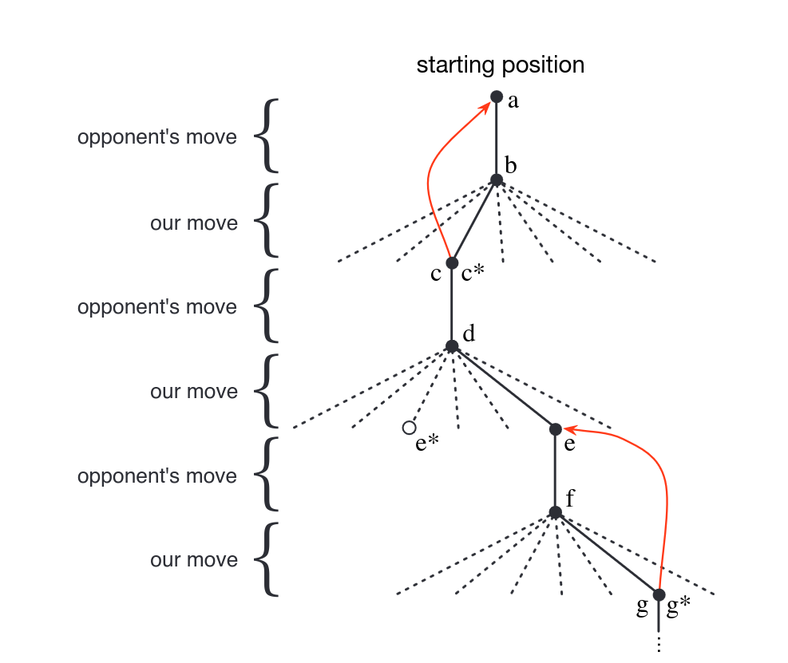

# Reinforcement Learning on TicTacToe 
## Documents
- [Task](./Documents/P05_ReinforcementLearning.pdf)

- [Reinforcement Learning - An Introduction](./Documents/RLbook2020.pdf)

## Notes on implementation
- Table of values for each possible game state -> whole table is the value function
- A state has higher value than another, when it has a higher probability to win from this state.
- Initial values are all 0.5 i.e. 50% chance to win
- Play game, choosing next move greedily based on next states value
- Sometimes chose a worse move randomly -> exploration. Let's us experience moves we might else never see.
- After a move (ours and our opponents) we update the probability of the starting state to be closer to the probability further down the tree. Shown in graph by red line

- Update function is written as: $$V(S_t) \leftarrow V(S_t) + \alpha[V(S_{t+1}) - V(S_t)]$$ with $$V(S_t)$$ being the value of our initial state (a) and $$V(S_{t+1})$$ being the next state (c). $$\alpha$$ is a variable called step size, which influences learning rate. 
- The whole update function is called temporal difference learning.

